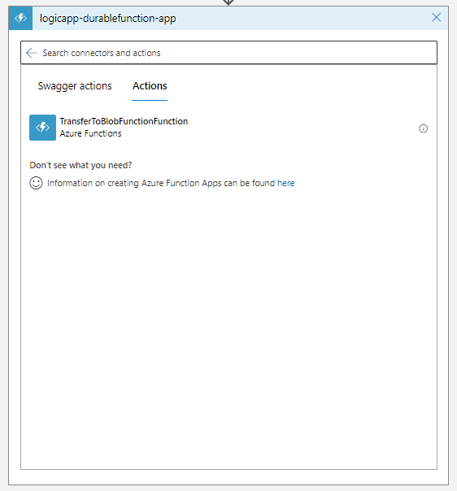

# Using Durable functions for long running operations in Logic Apps 

## Scenario
This scenario uses a Logic App trigger to move a file from SharePoint into Azure Blob storage.

##### Issues that prevent the wanted functionality include.

- Logic apps currently has a input limit of 105 mb.
- Most connector uploads will timeout after 2 minutes as logic apps has a limit of 2 minutes on synchoronus activities.
  
Utilizing durable functions we can use a Async HTTP polling pattern where the Logic App will send a request to the Azure Durable Function, the request will return a 202 "Accepted" status to the Logic App in addition to a url used for polling and checking the completed status fo the file upload.

##### Async HTTP APIs

#Deployment

A Github Action in this repository can deploy the durable function to an Azure Subscription or alternativley deploy the code manually to Azure.

To utilize the Github Action Deployment

1. Clone Repository
2. [Create a service principal and add it as a GitHub secret](https://docs.microsoft.com/en-us/azure/developer/github/connect-from-azure?tabs=azure-portal%2Cwindows#create-a-service-principal-and-add-it-as-a-github-secret)
3. Run the "Deploy Logic App - Durable Function Sample" and update any of the defaults (optional)

##### *Note
The scenario is desinged for SharePoint but the functions work using a file Url as input and will work as long as the managed identity created in deployment step 2 has access to the resource.

The Deployment creates the following resources 
 
- Storage Account (and Blob Container)
- App Service Plan
- Function App with deployed Durable Function
- Permissions for Function App include Graph API permission for Site.Read.All and Azure role of 'Storage Blob Contributor'

#Sample Logic App Usage

1. Create a Logic App in your Azure Subscription (Consumption Tier)

1.Start from a blank Logic App

1.Select a trigger for the logic app, in this case the trigger is when a file or item is modified.

1.Update the trigger with the site address and document library
 

1. Add a new step and select Azure Functions

1. Select the function from the avaiable function dialog

1. Select the 'Swagger Actions' tab

1.Update the action with the 'Link to item' property from the previous action in dynamic content

##### Test by adding or altering an existing file in the SharePoint document library